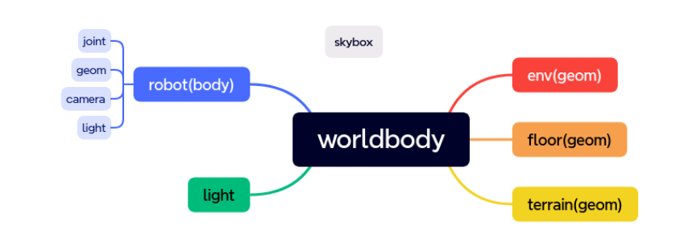

# 1.一些compiler，option和外观上的东西
```XML
<mujoco model="inverted_pendulum">
    <compilter angle="radian/degree" autolimits="true" > 
```

    compilter编译器节点：角度制 autolimit是受力限制
```XML
 <option timestep = "0.002" gravity="0 0 -9.81" integrator="implicitfast">
```
 option节点 timestep代表仿真走一步的时间，也就是运行一次之后仿真计算出timestep时长后的世界，单位秒。timestep是一定要规定的，不然仿真不知道如何计算
    integrator 是积分器的方法：最好用implicitfast
    solver 是求解器的方法：默认是牛顿
```XML
    <visual>
        <global realtime="1" />
```
        这个是仿真速度比例，是与真实世界的比例
```XML
    <quality shadowsize="16384" numslices="28" offsamples="4" />
```
    shadowsize是阴影细节
```XML
    <headlight diffuse="1 1 1" specular="0.5 0.5 0.5" active="1" />
```
    这个active是开关头灯 diffuse是漫反射光的rgb specular是镜面反射的光,这个active得是1
```XML
        <rgba fog="1 0 0 1" haze="1 1 1 1" />
    </visual>
```
```XML
    <asset>
        <mesh name="tetrahedron" vertex="0 0 0 1 0 0 0 1 0 0 0 1" />
```
这个mesh既可以自己导入obj/stl也可以设 vertex vertex(顶点)是坐标的数组，这些坐标连接成一个几何体
```XMl
        <mesh file="card.obj" scale="1 1 1" />
```
读取的不管是obj还是stl文件，可能都没有经历过单位化的过程，故有缩放这个功能诞生
```XML
        <texture type="2d" file="./king_of_clubs.png" />
```
texture用来加载纹理资源，只可以加载png格式，要指定好type类型：2d, cube, skybox，至于这里其实少了一个参数就是name，他会找到你指定的name把这个贴图加入进去，但是这里省略了你给定的name
```XML
        <material name="king_of_clubs" texture="king_of_clubs" />
        <hfield name="agent_eval_gym" file="agent_eval_gym.png" size="10 10 1 1" />
```
这个hfield是高度场，它是通过读取一个二维的图片只可以是png，将它二值化，根据灰度和你给定的高度，生成地形具体如下：
ile="path.png"（加载PNG图片,彩色的会转成灰度，根据灰度信息生成高度）
size="0 0 0 0"（场的尺寸，radius_x，radius_y，elevation_z，base_z，可
以理解场 X方向大小，Y方向大小，最高海拔，灰度会映射到[0,-1]，elevation则是实际高度，base_z是基底高度）
```XML
        <texture type="skybox" file="../asset/desert.png"
            gridsize="3 4" gridlayout=".U..LFRB.D.." />
```
加载天空盒贴图要写入gridlayout
        <!-- <texture type="skybox" builtin="flat" rgb1="1 1 .1" rgb2=".9 .9 .9" width="128" height="128"/> -->
```XML
        <texture name="plane" type="2d" builtin="checker" rgb1=".1 .1 .1" rgb2=".9 .9 .9"
            width="512" height="512" mark="cross" markrgb=".8 .8 .8" />
```
这个是使用mujoco自带程序化生成的纹理资源，加载地板，builtin一共有：gradient这个是渐变的颜色，checker是生成格子颜色，flat是全部填充一个颜色，额外的要传入rgb1和rgb2
builtin="none/gradient/checker/flat"
用来生成程序化纹理
  none就要自己加载
  gradient是rgb1 过渡到 rgb2
  checker是rgb1 和 rgb2 在2*2网格交替
  flat是 rgb1 填充，但是当 type为 cube和skybox时用rgb2填充
地板要用几何体构建
但是纹理资源不可以直接被使用，需要赋到material再加载到geom里面才可以使用
但是天空盒可以，因为天空盒是唯一的
```XML
        <material name="plane" reflectance="0.3" texture="plane" texrepeat="1 1" texuniform="true" />
        <material name="box" rgba="0 0.5 0 1" emission="0" />
    </asset>
```
material 材质节点
mesh和hfield是对几何体的构造，而material则是对几何体表面的构造。mesh和 hfield是几何体的类型，而material就是几何体的属性，几何体可以直接加载material。
name=""（用来索引）
rgba="0 0 0 0"
  四通道色彩
specular="0.5"
  镜面反射程度[0,1]，有色物体反射的光是物体颜色，这个也就是物体颜色的反射程度
shininess="0.5"
  亮度[0,1]
reflectance="0"
  反射率[0,-1]
metallic="0"
  数值高就接近金属质感,mujoco 自己渲染不出来
roughness="0"
  越高越粗糙,,mujoco自己渲染不出来
emission="0"
  向外发光程度，发射的是材质光
texture=""
  指定texture
```XML
    <default>
        <geom solref=".5e-4" solimp="0.9 0.99 1e-4" fluidcoef="0.5 0.25 0.5 2.0 1.0" />
        <default class="card">
            <geom type="mesh" mesh="card" mass="1.84e-4" fluidshape="ellipsoid" contype="0"
                conaffinity="0" />
        </default>
        <default class="collision">
            <geom type="box" mass="0" size="0.047 0.032 .00035" group="3" friction=".1" />
        </default>
    </default>
```
# 2.关于worldbody
worldbody是 mujoco世界的根，世界之源，承载仿真世界的节点，任何要仿真的
物体都要写道 worldbody节点中。worldbody内部大致如下图：

**就是你要干什么的都需要在worldbody下进行**

```XML
    <worldbody>
        <geom name="floor" pos="0 0 0" size="0 0 .25" type="plane" material="plane"
            condim="3" />
        <light directional="true" ambient=".3 .3 .3" pos="30 30 30" dir="0 -2 -1"
            diffuse=".5 .5 .5" specular=".5 .5 .5" />

        <body pos="0 0 1" euler="-45 45 0">
            <freejoint />
            <geom class="card" material="king_of_clubs" />
            <geom class="collision" />
        </body>

        <geom type="hfield" hfield="agent_eval_gym" pos="0 11 0" />

        <body pos="-1 0 .5">
            <freejoint />
            <geom type="sphere" size="0.1" rgba=".5 0 0 1" />
        </body>
        <body pos="-0.5 0 .5">
            <freejoint />
            <geom type="box" size="0.1 0.1 0.1" material="box" />
        </body>
        <body pos="0 0 .5">
            <freejoint />
            <geom type="capsule" size="0.1 0.1" rgba="0 0 .5 1" />
        </body>
        <body pos=".5 0 .5">
            <freejoint />
            <geom type="cylinder" size="0.1 0.1" rgba=".5 .5 0 1" />
        </body>
        <body pos="1 0 .5">
            <freejoint />
            <geom type="ellipsoid" size="0.2 0.2 0.1" rgba="0 .5 .5 1" />
        </body>
        <body pos="1.5 0 .5">
            <freejoint />
            <geom type="ellipsoid" size="0.2 0.1 0.1" rgba=".5 0 .5 1" />
        </body>

        <body pos="2.0 0 .5">
            <freejoint />
            <geom type="mesh" mesh="tetrahedron" rgba=".5 .5 .5 1" />
        </body>
    </worldbody>
</mujoco>
```
# 3.几何体geom
# 3.1name type 和size
要写name
type="[plane/hfield/sphere/capsule/ellipsoid/cylinder/box/mesh/sdf]"
size和type有关
首先
1. type：plane 
最常用于地板 需要3个size参数：x半长、y半长、渲染网格的间距（这个不重要），当x和y半长为0时，地板为无限长
2. type：hfield（高度场）
它不需要size
3. sphere球
size只需要半径
4. capsule胶囊
胶囊只需要1/2个参数 
2个是一个是半长 一个是半圆
1个的是指定半径 再多加一个参数：
fromto
fromto="0 0 0 0 0 0"
  按照向量的方式决定几何体的长度和姿态，只能用于capsule、box、cylinder和ellipsoid，前三个是point1，后三个point2几何体的Z轴正方向为point2->point1,长度则为该向量模长
5. cylinder圆柱
2个参数，一个半高 一个半径
6. ellipsoid椭球
三个参数 参考圆锥曲线
7. box	
3	X半长;Y半长;Z半长
8. mesh	
0	将忽略几何尺寸，改用网格尺寸

# 3.2quat, axisangle, xyaxes, zaxis, euler（表示姿态）
  quat是四元数,参数为w,x,y,z
  euler是欧拉角，参数为x,y,z

geom也可以给定质量或密度，他会自行计算，如果不给定会以水的密度作为默认
参数mass和density，单位：kg和kg/m3
python3 -m mujoco.viewer运行
# 3.3contype与conaffinity
contype是碰撞类型
conaffinity是可以和哪个类型的碰撞
他们传入参数是10进制的数字，但他的底层是二进制掩护码，注意这两个要同时设置，你如所有的geom都不设置，那默认就是同一个，都可以相互碰撞。
如果要设置那么，contype相当于单开一栏，把这个geom归属到新的分类，conaffinity是指定这个分类可以与哪些碰撞
eg
A碰撞类型是01
B的是10
C的可碰撞类型是11,那么c可以和ab碰撞
# 3.4condim
condim	Description
1	无摩擦接触
3	有规律的摩擦接触，在切线平面上有相反的滑移
4	摩擦接触，切线平面的反向滑移和围绕接触法线的旋转。这是 可用于对软接触进行建模（与接触穿透无关）
6	摩擦接触、切线平面内的反滑移、围绕接触法线旋转和旋转 围绕切线平面的两个轴。后一种摩擦效应有助于预防 无限滚动的对象

# 4.site
简易版 geom，不作为碰撞体积和质量计算，只能使用简易几何体。
用于在某些小部位安装传感器或者小结构渲染等，其属性和 geom非常相近。

# 5.body
通常body里面要写入geom
body可以传入的参数是空间内的六轴 还有 name
想让一个body里面的东西发挥出空间内的自由度，要加入<freejoint />
另外body是可以嵌套的，但是freejoint只可以加入最外层的body里面，不可以加入子body